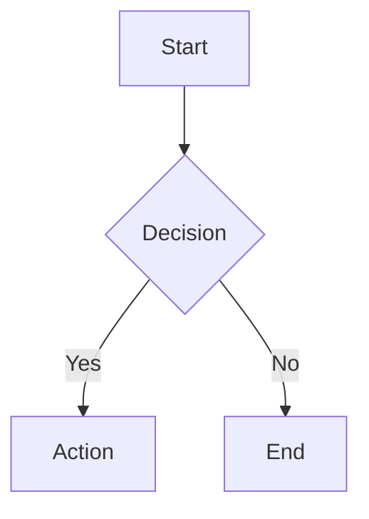

# mermaid-cli

mmdc (Mermaid CLI) を使って Mermaid 記法のダイアグラムを画像ファイルに変換する。

## Context

- Working directory: !`pwd`

## 基本ワークフロー

### Step 1: Mermaid ファイルの作成

`.mmd` 拡張子で Mermaid 記法のファイルを作成する。



### Step 2: 画像変換

#### PNG (Confluence 添付・ドキュメント用、推奨)

```bash
mmdc -i input.mmd -o output.png -c ~/.claude/skills/mermaid-cli/config.json -s 2 -w 1200 -b white
```

- `-s 2`: スケール2倍 (高解像度)
- `-w 1200`: 幅1200px
- `-b white`: 白背景 (透過にしたい場合は `transparent`)

#### SVG

```bash
mmdc -i input.mmd -o output.svg -c ~/.claude/skills/mermaid-cli/config.json
```

#### PDF

```bash
mmdc -i input.mmd -o output.pdf -c ~/.claude/skills/mermaid-cli/config.json
```

### Step 3: 出力確認

```bash
ls -la output.png
file output.png
```

画像が正常に生成されたことを確認する。

## テーマ選択

| テーマ | 用途 |
|--------|------|
| `default` | 一般的な用途 (デフォルト) |
| `dark` | ダークモード向け |
| `forest` | グリーン系カラースキーム |
| `neutral` | モノクロ・印刷向け |

```bash
mmdc -i input.mmd -o output.png -c ~/.claude/skills/mermaid-cli/config.json -t neutral -s 2 -w 1200 -b white
```

## 日本語フォント設定

スキルディレクトリに同梱の `config.json` で日本語フォント (Cica) を指定している。
全コマンド例に `-c ~/.claude/skills/mermaid-cli/config.json` が組み込み済み。

- **フォント変更**: `~/.claude/skills/mermaid-cli/config.json` の `fontFamily` を編集する
- **Cica インストール**: `brew install --cask font-cica`
- **インストール確認**: `fc-list | grep -i cica`

## 一時ファイル管理

Confluence 添付など一時的な画像生成では、`/tmp` 配下を使用する。

```bash
TMPDIR=$(mktemp -d)
mmdc -i diagram.mmd -o "${TMPDIR}/diagram.png" -c ~/.claude/skills/mermaid-cli/config.json -s 2 -w 1200 -b white
# 使用後
rm -rf "${TMPDIR}"
```

## トラブルシューティング

- **mmdc が見つからない**: `brew install mermaid-cli` でインストール
- **Puppeteer エラー**: `npx puppeteer browsers install chrome` でブラウザ再インストール
- **日本語文字化け**: 「日本語フォント設定」セクションを参照

## 詳細オプション

references/mmdc-options.md を参照。
